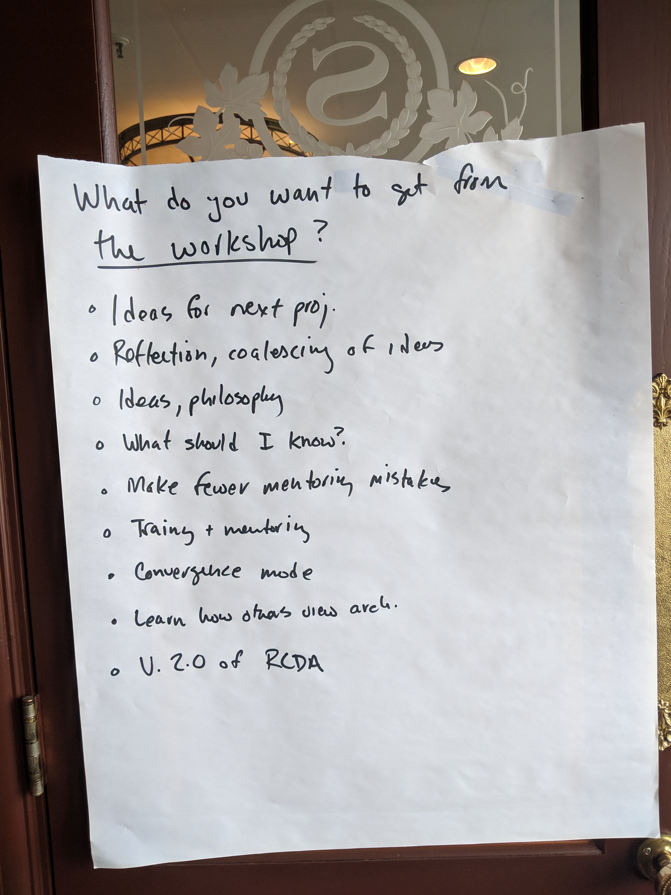

# What do you want to get from the workshop?

* Ideas for next project
* Reflection, coalescing of ideas
* Ideas, philosophy
* What should I know?
* Make fewer mentoring mistakes
* Training and mentoring
* Convergence mode
* Learn how others view architecture
* Version 2.0 of Risk and Cost Driven Architecture

